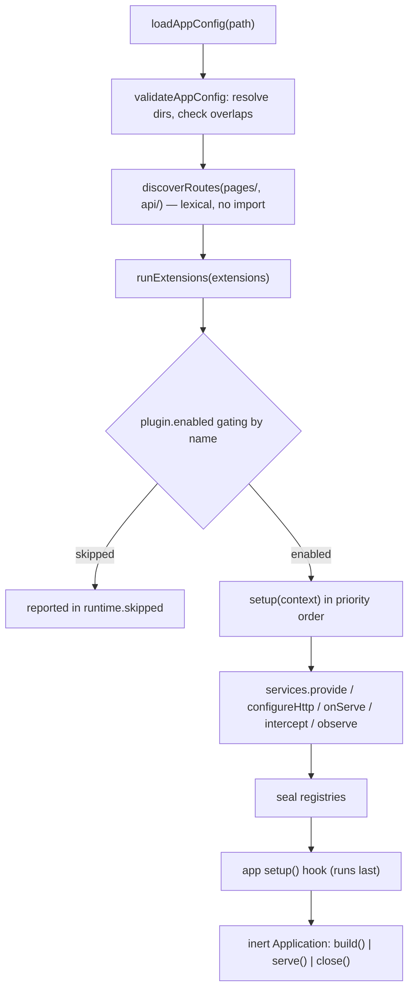
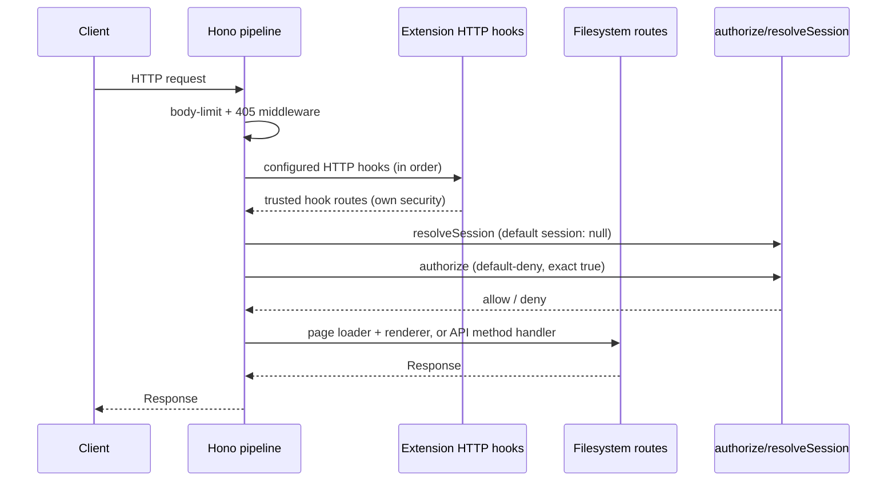
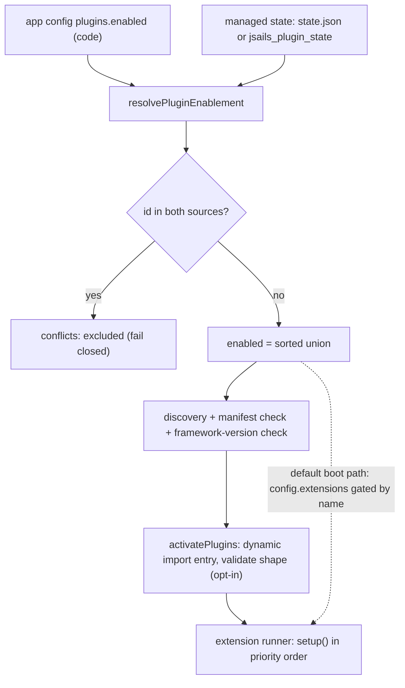
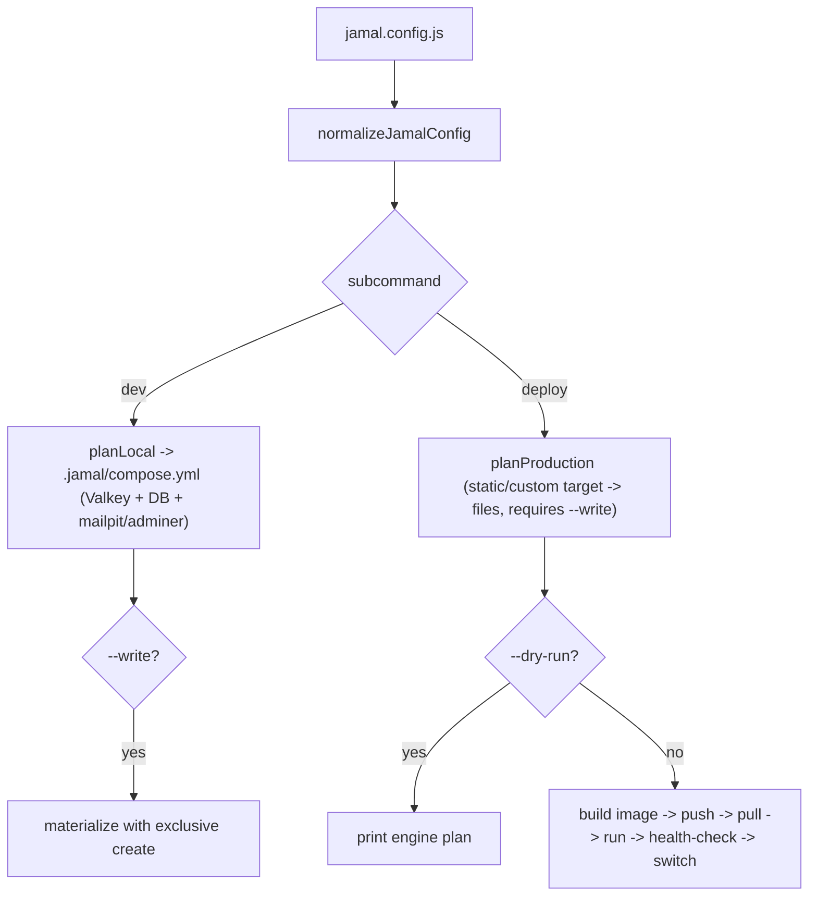

# JSails Architecture

This document describes how JSails is assembled and how its pieces fit together.
It is written from the source in `src/`, not from the reader guide — where the two
disagree, this document follows the code. See [CODEMAP.md](./CODEMAP.md) for a
directory-level map.

JSails is a TypeScript Active Record data layer plus a bounded application runtime
(extension system, HTTP/pages/API, static export, jobs, broadcast, deploy config,
and a CLI). It is **not** a complete MVC framework: it deliberately reuses
maintained libraries — TypeORM, Zod, BullMQ, Socket.IO, Preact, Hono — instead of
implementing its own renderer, auth stack, or queue.

## 1. Overview and principles

The design follows a small set of explicit principles:

- **Human-first.** The CLI scaffolds, compiles, and serves, but decisions with
  domain impact — applying migrations, destructive schema changes, running a
  production release — remain explicit human actions: the operator names the
  environment and the verb, never an auto-detection. `jamal deploy` and
  `jamal rollback` execute by default and `--dry-run` prints the plan; `jamal
  dev`/`jamal harden` write nothing until `--write`, and static/custom deploy
  targets only generate files. Server hardening is emitted as a script a human
  reviews and runs, never executed by JSails.
- **Everything is a plugin.** The kernel is a thin, inert core (config loading, an
  ordered extension runner, route discovery, the Hono pipeline, the data layer)
  and every capability — auth, admin, blog, jobs, broadcast, cache, mail,
  filesystem, notifications, server components — is a first-party plugin wired
  through the same extension seam described in [§2](#2-kernel-vs-plugins).
- **Lazy, inert construction.** Importing a config module or calling a factory
  never opens a connection or reads the environment. Connections are opened only
  by `serve()` (or an extension's own `setup`/first use). This is what keeps
  `jsails build` (static export) working without a database.
- **MariaDB by default, but no lock-in.** `JsailsDataSource` restricts drivers to
  `mariadb` (recommended), `postgres`, and the legacy `mysql`, plus a persistent
  file-backed `sqljs`/SQLite surface. Better Auth in the starter targets MariaDB.
- **Bounded, portable schema.** The migration core models a narrow scalar schema
  (see [§3](#3-data-layer)) and rejects anything it cannot faithfully represent
  rather than silently losing semantics.
- **Value-free errors.** Failures that cross a trust boundary never echo raw
  values, credentials, or response bodies. Errors carry a `code` and a safe
  message only.

## 2. Kernel vs plugins

The **kernel** (`src/app/`, `src/extensions/`, `src/routing/`, `src/pages/`,
`src/server/`, `src/database/`, `src/migrations/`, `src/environment.ts`, `src/contracts/`,
`src/jsx/`) provides the runtime and the seams; the **plugins** (`src/auth/`,
`src/admin/`, `src/blog/`, `src/jobs/`, `src/broadcast/`, `src/cache/`,
`src/mail/`, `src/filesystem/`, `src/notifications/`, `src/sessions/`,
`src/server-components/`, `src/flags/`, `src/theme/`, `src/plugins/`) consume them. The
`src/i18n/` translator is a dependency-free leaf (neither kernel nor plugin —
it imports nothing beyond the platform). The distinction is a
convention, not a hard boundary: the kernel's extension foundation is also the
public `jsails/extensions` surface.

### The extension foundation

An **extension** is a plain object `{ name, requires?, priority?, disabled?,
setup(context) }`. `runExtensions` (in `src/extensions/extension.ts`) prevalidates
every entry, runs `setup` in priority order (lower first, then declaration order),
checks each extension's `requires` against services earlier extensions actually
registered, collects HTTP and serve hooks, wires a per-application
interceptor/observer registry, seals the registries, and returns a runtime whose
`close()` runs cleanups in reverse. On any failure the already-completed
extensions are cleaned up and the registry cleared.

The `setup` context exposes four write surfaces:

- `services.provide(token, value)` / `services.get(token)` — a per-application
  service registry keyed by opaque `createServiceToken<T>(name)` tokens (identity
  is the object, never the name). Services are fresh per application; there is no
  global registry.
- `configureHttp(hook)` — collect native Hono hooks (run in registration order,
  **after** the body-limit/405 middleware and **before** the filesystem routes).
  Hook routes own their own security; they bypass the filesystem default-deny
  pipeline.
- `onServe(hook)` — run after the HTTP server is created but before it listens;
  receives the `node:http.Server` plus the resolved config and sealed registry.
- `intercept(operation, fn, { phase })` / `observe(event, fn)` — identity-based
  interception (`src/extensions/interceptors.ts`). `defineOperation`/`defineEvent`
  mint tokens; `before` hooks mutate args in ascending priority order,
  `after` hooks transform the result in reverse order, and observers react to
  emitted events with errors isolated. There is no general `around` hook.

A **plugin** (`definePlugin`, in `src/extensions/plugin.ts`) is an extension with
two additions: declarative passthroughs (`deployments`, `renderer`) carried by
identity for the config loader, and a `PluginContext` whose `setup` can register
interceptors/observers. At runtime a plugin compiles to the low-level
`JsailsExtension` shape.

### Substrate vs. plugin boundary

Not everything can be an extension. The **substrate** is everything upstream of
`runExtensions` — the code that must run *before* any extension can exist: the
CLI entry and command dispatch (`src/cli.ts`), the app config loader
(`loadAppConfig` / `validateAppConfig`), the extension runner and service
registry themselves, route discovery (`discoverRoutes`), and pure plugin
enablement (`resolvePluginEnablement` / `loadPluginEnablement`). An extension
cannot run itself, so these stay in core; everything above that line is
plugin-shaped.

The read-only introspection commands (`inspect`, `describe`, `explain`) are
deliberately substrate, not an `introspect` plugin: they are early-routed
*before* config loading and own their own `--config` flag, so they work from any
cwd with no app config. The extension `commands` seam is only collected after
`loadAppConfig`, so moving them behind it would force an app config to load
first and destroy that property. Their names are reserved so a user command
cannot be silently shadowed by the early routing.

### Application assembly

`loadAppConfig` imports the compiled config module; `validateAppConfig` resolves
directories; `createApplication` discovers routes, runs the extensions, then the
app `setup` hook, and returns an inert `Application`. `plugins.enabled` gates the
built-in `extensions` by name: an extension whose `name` is not listed is skipped
before its `setup` runs.



## 3. Data layer

`JsailsDataSource` (`src/database/data-source.ts`) extends TypeORM's
`DataSource` and restricts drivers to `postgres | mysql | mariadb | sqlite`
(the `sqlite` logical driver is surfaced through TypeORM's `sqljs` driver as a
persistent, single-file database with an atomic write-then-rename `autoSave`
callback — single-process, no WAL). It rejects `synchronize`, `dropSchema`,
`migrationsRun`, and a TypeORM `migrations` config at construction: JSails owns its
schema history. `getModelSchema()` builds entity metadata offline — it never opens
a connection.

Entities use `BaseEntity` (Active Record) or `EntitySchema`. The portable schema
model (`src/database/model-schema.ts` → `SchemaState`) is deliberately bounded:

- **Supported:** scalar columns (`integer`, `varchar` with explicit `length`,
  `text`, `boolean`, `datetime`), a single generated integer primary key or a
  **composite primary key**, simple (non-partial, non-expression,
  non-fulltext/spatial) indexes, simple unique constraints, and single- or
  **multi-column (composite) many-to-one foreign keys** with
  `CASCADE`/`RESTRICT`/`SET NULL`/`NO ACTION` actions. **Many-to-many** relations
  are supported through explicit junction-table entities or auto-generated
  `@JoinTable()` junction tables (a composite primary key plus two foreign keys).
  **Deferrable** foreign keys and unique constraints are supported on Postgres
  only; non-postgres drivers reject them value-free. One-to-many inverse
  relations are accepted and ignored.
- **Rejected** with `UnsupportedSchemaError`: one-to-one relations, partial or
  expression indexes, enums, generated UUIDs, computed columns, custom
  transformers, function defaults, `@CreateDateColumn`/`@UpdateDateColumn`, tree
  columns, and inherited/embedded entities.

`FileDataSource` (`src/database/file-data-source.ts`) is a **read-only**, in-memory
Active Record source over TypeORM's `sqljs` driver. It seeds from `rows` or a JSON
`file`, validates every row against the portable schema, then flips SQLite into
`query_only` mode. `createEntitySubscriber`/`defineEntityHooks`
(`src/database/entity-subscribers.ts`) and `defineFactory` (`src/database/factories.ts`) round
out the entity toolkit.

### Migrations

Migrations are **scalar and linear**. A definition is a JSON file in `migrations/`
recording operation/type metadata (schema history), not a live schema.

- `makemigrations` diffs the model metadata against recorded history via
  `generateMigration` (`src/migrations/autodetector.ts`) — it never introspects the
  database. The diff is conservative: destructive changes (drop table/column, type
  or varchar-length alteration, making a column non-nullable, primary-key changes)
  require `allowDestructive`; a required new column without a default is rejected;
  renames are never inferred from a drop+add pair without an explicit hint.
- `migrate` replays the linear chain through `src/migrations/migrator.ts`, tracking
  applied state in `jsails_migrations`. Application is forward-only.
- Rollback (`rollbackTo` / `migrate --down` / `migrate --steps`) replays the
  recorded operations' inverses (`invertOperation` in `src/migrations/operations.ts`):
  every destructive operation retains the definition it removed, so a rollback
  re-creates dropped tables/columns and reverts renames/alterations exactly.
  `--down`/`--steps` require `--allow-destructive`.
- `showmigrations` accepts `--format table|json|plan` for human-readable,
  machine-readable, and plan-mode output, respectively.
- `migrate --fake` records a migration as applied without running it;
  `--fake-initial` marks the first migration already applied (for applying
  history to an existing database). Neither flag executes DDL or touches data.
- **Data migrations** (`defineDataMigration` / `createDataMigrationRegistry`) are
  named, invertible functions (`up`/`down`) that run against a live database
  connection through a `DataMigrationContext` query runner (no DDL). They carry
  `kind: 'data'` and are sequenced in the same linear chain as schema migrations;
  rollback refuses a data migration without `down`.
- **Squashing** (`squashMigrations`) replaces a contiguous applied range of schema
  migrations with a single cumulative migration that replays every operation from
  the range onto the empty schema. It defaults to rejecting data migration
  boundaries unless `allowCrossKind` is set; the output is deterministic for the
  same inputs.

## 4. HTTP, pages & server components

**HTTP is Hono.** `createApp` + `createHttpServer` (`src/server/app.ts`,
`src/server/http.ts`) build the pipeline but never listen. An API module exports
named HTTP-method handlers `(request, context) => Response`; there is no
default-export guessing.

- **Routing** is lexical and import-free: `discoverRoutes` walks `pages/` and
  `api/` (only compiled `.js`/`.mjs`), mounts `api/` under `/api`, and accepts only
  single-segment `[id]` params (`[...id]` catch-alls are rejected).
- **Pages** are compiled modules: a function default export, optional `load(context)`
  for async props, optional `getStaticPaths()`. The built-in `preactPageRenderer`
  renders Preact SSR; `renderer` is a `PageRenderer` seam (its returned string is
  trusted producer HTML).
- **`jsails build`** is a static export: render every page (expanding
  `getStaticPaths`), copy `public/` byte-for-byte, swap into `out/` through a
  staging directory. API routes are never rendered.
- **Default-deny authorization.** The global `authorize(context)` must resolve to
  exactly `true`; anything else denies. `resolveSession(request)` is the trusted
  session seam (default `session: null`). Cookie-authenticated mutations require a
  same-origin `Origin` plus a matching `X-CSRF-Token`; `publicOrigin` is consulted
  only for that `Origin` check behind a TLS-terminating proxy.
- **API resources** (`createResourceHandlers`, `defineSerializer`,
  `parseFilters`, `require`/`and`/`or`/`resourcePolicy`, `throttle`, `readForm`,
  `generateOpenApi`) are browser-safe and live in `jsails/api`; they depend only on
  Zod and web-standard types and make no ORM assumptions.

#### Route groups and nested layouts

Route groups and nested layouts are two orthogonal mechanisms discovered during
the lexical route scan and applied at render time. Neither requires importing a
route module — the chain is built from the directory tree alone.

**Discovery** (`src/routing/routes.ts`):

- A directory whose name matches `(name)` (`name` restricted to `[A-Za-z0-9_-]+`)
  is a **route group**. `discoverRoutes` strips group directories from the URL
  path for pages (the `(name)` contributes no segment), but they survive in the
  filesystem prefix that builds the ancestor layout chain. In `api/` the parens
  fail the safe-static-segment check and the directory is rejected, so groups are
  pages-only by construction.
- A file named `layout.js` or `layout.mjs` in any `pages/` directory is a
  **layout module**. It is discovered in the same single-pass `readdirSync` walk
  as route modules, recorded by its relative directory prefix, and excluded from
  the route manifest — a `layout.js` is never a URL route.
- `RouteManifestEntry.layouts` carries the absolute paths of every layout module
  from the root `pages/` directory down to the page's parent directory, outermost
  first. The chain includes group directories: `pages/(auth)/layout.js` attaches
  to every page under `(auth)/` without adding `/auth` to the URL.

**Rendering** (`src/pages/page.ts`):

- `loadLayoutModule` imports the compiled layout module and validates that its
  default export is a function (sync or async). There is no `load`,
  `getStaticPaths`, or `middleware` surface on a layout — the contract is just
  `default(props: LayoutProps, context?) => RenderChild`.
- `renderRoute` folds the layout chain **inside-out**: the innermost layout (the
  one closest to the page's directory) wraps the page component first, and each
  outer layout wraps the result of the inner layers. The framework spreads the
  page's resolved props into every layout, then sets `children` explicitly — a
  page prop named `children` is overwritten by the actual child element.
- After folding, if the outermost layout emitted an `<html>` root element, the
  minimal document shell (`<html><head><meta charset="utf-8"></head><body>`) is
  skipped; otherwise it is appended.
- The static export (`generateStaticSite`) folds layouts identically — no code
  path differs between `serve` and `build`.

**v1 limits.** Layouts have no `load` hook (they receive the page's resolved
props), no `middleware`, and no `SERVER_ONLY` check. Groups are pages-only.
There are no loading/error boundaries, and no parallel or intercepting routes.
A page opts into route-level data caching with `export const revalidate =
<seconds>`: `renderRoute` caches the `load` result through the `cache` plugin's
store, keyed by route pattern, resolved params, and a stable hash of the query
string; static export always renders fresh. The `describe`/introspect surfaces
expose `layoutCount` (a count of layout-bearing entries) but never absolute
layout paths.

There is a **programmatic API router and versioning layer**: `createResourceRouter`
produces a deterministic route manifest from named resource handlers (rejecting
duplicate method+path combinations), and `resolveApiVersion` negotiates versions
from URL path prefix and Accept header (URL always takes precedence), with
`versionedNotFound()` / `versionedNotAcceptable()` helpers for failure responses.

The request lifecycle:



#### Per-route middleware

A compiled page or API module may export `middleware`, an array of
`RouteMiddleware` handlers `(context, next) => Response | Promise<Response>`
applied in declared order before the terminal handler. The **ordering
invariant** is fixed and middleware can never run before the default-deny gates:

```
body-limit/405 → session → origin/CSRF → global authorize → module authorize
    → global middleware → per-route middleware → handler
```

- **Global middleware** (`globalMiddleware: readonly RouteMiddlewareRef[]` in the
  app config) runs after the `authorize` gates, before per-route chains, for
  both API and page routes. Extensions add to this chain through
  `configureMiddleware(handler)` on the `ExtensionRuntime`.
- **Named registry** (`middleware: Record<string, RouteMiddleware>`) is built at
  assembly time. Routes reference registered names (or inline functions) in their
  `middleware` export; `resolveMiddlewareRefs` resolves names to handlers.
- **Short-circuit.** A handler that returns without calling `next()` ends the
  chain; the returned `Response` is trusted producer output. A thrown/rejected
  handler surfaces as the standard sanitized 500.
- **Request-scoped.** `next()` is callable at most once; a second call throws a
  `MiddlewareError`.
- **Static export.** Never runs middleware — page rendering is pure and
  connectionless.
- **Limits.** No reordering of built-in pipeline steps; no middleware on
  framework-owned routes (`/up`, `/_jsails/introspect`, server-component updates,
  extension HTTP hooks); no route-path-keyed config map; no lazy/async name
  resolution.

### Server components

`jsails/server-components` is a Livewire-like, signed, **stateless** state
protocol: state is carried in an HMAC-signed snapshot, not a server-side store.
`defineServerComponent`/`defineAction` define a component (`stateSchema` forced
`.strict()`, `writableKeys` restricting *client* edits only, a **required**
default-deny `authorize`, actions with their own `input` schema, and `render(state,
{ bind, call, submit })`). The runtime mounts `POST /_jsails/components/update`
only when an extension registered one, and it owns every origin/CSRF/signature
check. **State is public** — integrity-protected, never encrypted. Static export
renders only `staticFallback` (no state, no signing key, no actions).

A definition may also declare optional **lifecycle hooks** (awaited in order):
`mount(context)` runs once on the first live render; `hydrate(state, context)`
runs after a snapshot verifies and before any client edit; `updating(state,
context)` runs before client edits (and may throw a value-free error to reject
them); `updated(state, context)` runs after a successful update or action, before
the re-render. Hooks receive the mutable server-side state (except `mount`) and
may mutate it in place. **Computed properties** (`computed: { name: (state,
context) => value }`) derive a read-only view value at render time (async
allowed) exposed to `render` through `tools.computed(name)`, memoized per render,
never persisted, and never client-writable; a name colliding with a top-level
state field is rejected at definition time.

```mermaid
sequenceDiagram
    participant B as Browser
    participant U as POST /_jsails/components/update
    participant R as Runtime
    participant C as Component

    B->>U: submit (snapshot + CSRF + Origin)
    U->>R: verify snapshot (HMAC, expiry, subject binding, origin)
    R->>R: CSRF check (session token, or snapshot id for anonymous)
    R->>C: authorize(context) — current request, default-deny
    C-->>R: allow / deny
    R->>R: apply client edits under writableKeys; validate strict state
    R->>C: run at most one allowlisted action (args via input schema)
    C-->>R: mutate state (may throw ZodError -> 422 field errors)
    R->>R: re-validate whole state
    R-->>B: re-signed snapshot + synchronized HTML
```

A component definition may also use:

- **Form objects** (`defineForm`) — a Livewire-style abstraction that wraps a Zod
  object schema and provides typed field access, imperative `fill`/`validate`/`reset`
  helpers, and `toState`/`fromState` JSON round-trip methods compatible with the
  server-component snapshot protocol. A `FormObject` is a plain object the
  component author creates inside an action or lifecycle hook.
- **Nested (child) components** (`defineNestedComponent` / `renderNested`) — a
  parent component may render independently authorised, stateful children,
  each with its own signed snapshot, CSRF marker, and security boundary.
  Child state is fully independent — every render/update goes through the child's
  own `mount` → `sign` → `verify` lifecycle, with its own `authorize` and
  `writableKeys`. `MAX_NESTING_DEPTH` (8) bounds the depth of nested component
  trees to prevent unbounded rendering. A `NestedComponentError` is raised
  when a component is not found, a depth is exceeded, or a child's own signature
  or security check fails.

## 5. Client runtime

`jsails/client` is the **browser-safe** runtime (`src/client/`). `startClient()`
dynamically imports Turbo, starts the shared session, registers declarative
islands, hydrates the initial markup, and auto-enables server-component bindings;
it is idempotent. `registerIsland(name, component)` registers typed Preact islands
(the same name + same component is a no-op; a different component throws). There
is **no automatic module discovery** — every island is registered explicitly.

Turbo owns all link interception and history. Ordinary same-origin `<a href>` links
get soft navigation over SSR and SSG pages; native opt-outs (external origin,
`download`, `target`, modified click, `data-turbo="false"`) fall through to full
navigation. `morphComponent(target, html)` renders a `<turbo-stream method="morph">`
message. Island props are decoded with bounded `JSON.parse` and reject
`__proto__`/`constructor`/`prototype` keys; hydration is tracked per element
identity (a `WeakMap`), never by the `data-hydrated` attribute alone. There is no
HMR.

Asset URLs (`src/app/asset-urls.ts`) map a public asset path to a content-hashed
`?v=<sha256>` query (cached by `mtimeMs` + size), so a changed build asset forces a
full reload via `data-turbo-track="reload"` while unchanged assets keep soft
navigation. The resolver degrades gracefully — a missing/unsafe path returns the
unversioned path unchanged.

**Hotwire Native web groundwork** (`src/client/native.js`) — a pure-path
configuration layer for Hotwire Native mobile-web hybrids, with no native SDK
dependency. `definePathConfiguration(rules)` builds a `PathConfiguration` from
application- or pattern-matched `PathRule`s; `resolvePathConfiguration(config,
path)` returns the best-matching rule for a given path. `isNativeApp()`
detects whether the client is a native app from its `User-Agent` string.
`nativeBridge` is a stub object (type only, no runtime implementation) —
JSails ships no bridge adapter, native bridge integration is the app's
responsibility. There is no automatic bridge injection, no URL interception,
and no native SDK bundle.

## 6. Admin

`jsails/admin` (`src/admin/`) is a first-party plugin: `adminPlugin` mounts the
dashboard, `/_search`, and `/actions/:name`, and `defineAdminPanel({ widgets,
notices, charts, theme, resolveSession | auth })` wires it — `theme` is
`'light' | 'dark' | 'system'` (default `'system'`), rendered as the document's
`data-theme` attribute with minimal light/dark CSS and no client bundle. The
building blocks are ORM-free
descriptors carried by identity: `defineWidget` (stat-card descriptors),
`defineNotice` (flash-message registry with the built-in success notice),
`defineAdminAction` (declarative header/row/bulk mutations with optional per-record
`authorize`), `defineChart` (dashboard SVG chart descriptors with trusted markup
`render` plus `lineChartSvg`/`barChartSvg` label-escaping helpers), and
`renderGlobalSearch` (server-rendered cross-resource search). A
`defineResource` descriptor owns its own CRUD surface — list columns (with
`badge`/`boolean`/`date` formats plus `sortable`, `searchable`, and `f_<name>`
select filters) and form fields (`text`, `textarea`, `select`, `toggle`, `number`,
`date`, `datetime`, `checkbox`, `radio`, `repeater`, `file`) — rendered by the
panel's own route registrar, independent of the `jsails/api` resource handlers.
Beyond the base form, a resource may declare **relation columns** (`type:
'relation'` + a `resolve(row)` callback rendering escaped labels), **repeater
fields** (a bounded list of scalar item fields submitted as flat `name[i].sub`
keys), an **infolist** (a read-only detail section above the edit form), and a
**file field** whose `resolveFileDisk({ session, fieldName })` resolver wires the
upload to a `jsails/filesystem` `Disk`. When built from
`auth: authSessionToken`, the admin plugin declares `requires: [authSessionToken]`,
so the `auth` plugin must be declared earlier or assembly fails. The default-deny
`authorize` allows any signed-in session — apps restrict it to an admin role via
`requireRole`/`adminOnly` (`jsails/auth`). The plugin-manager
(`src/plugin-manager/`) adds a `Plugin Settings` admin page: one form per
installed plugin whose manifest declares a `settingsSchema` (editable for
`string`/`number`/`boolean` fields, read-only otherwise), persisted per-plugin
in managed state and available only in managed mode.

## 7. Plugin system

The plugin system (`src/plugins/`, exported as `jsails/plugins`) covers the
manifest contract, two-source discovery, the framework-version check, the `.tgz`
extractor, persisted state, enablement merge, download-capability resolution, the
installer, and activation.

- **Enablement is two-source.** `resolvePluginEnablement({ codeEnabled, state })`
  merges `plugins.enabled` in the app config with managed state (a
  `<pluginsDir>/state.json` document or the database-backed
  `JsailsPluginState`/`jsails_plugin_state` table). `enabled` is the sorted union of
  the code list and every state id with `enabled === true`; ids present in **both**
  sources are `conflicts` and excluded (fail closed).
- **Managed vs non-managed.** `loadPluginEnablement` performs no state I/O when
  `managed !== true` (the static export is always non-managed); a managed deployment
  requires a state source.
- **Activation is the only code-executing step.** `activatePlugins` dynamically
  imports each enabled plugin's entry module (trusted plugin top-level code runs at
  import) and structurally validates the exported plugin object(s), never calling
  `setup` — the extension runner does that later. Discovery, check, and the
  installer only read and validate manifests and inputs.
- **Activation is opt-in, not part of the default boot path.** `createApplication`
  does not discover or dynamically import plugins: it runs the extensions the app
  config declares directly (`config.extensions`), gated by name through
  `plugins.enabled`. A deployment that wants discovery-driven activation calls
  `activatePlugins` itself and feeds the returned `plugins` into its extension
  list. This keeps the default boot path free of dynamic imports and managed-state
  I/O; the static export is always non-managed.
- The **plugin manager** (`src/plugin-manager/`) is the admin UI over the same
  surface, mounted by the `blog`/`--admin` starter variants.



## 8. Jobs, broadcast, cache, mail, filesystem, sessions, notifications, i18n, flags, theme

These are first-party plugins and services, each with its own subpath and an
explicit lazy-connect discipline.

- **Jobs** (`src/jobs/`) — `defineJob(schema, handler)` pairs a Zod schema with a
  typed handler; `createJobRegistry` validates the map. The **provider-neutral
  runtime** `createJobsRuntime({ registry, adapter, ... })` binds the registry to a
  `JobsRuntimeAdapter` and owns job-level policy (validation on enqueue and on
  processing, dispatch-option allowlisting, local schedule validation, idempotent
  `close`). `createBullMQAdapter({ redisUrl })` is the built-in default transport.
  Payloads are validated on dispatch **and** on the worker;
  importing never opens a Valkey connection. Scheduling is at-least-once.
- **Broadcast** (`src/broadcast/`) — `attachBroadcast(httpServer, options)` mounts a
  transport on the existing HTTP server under `/_jsails/broadcast`. The built-in
  Socket.IO adapter enforces a non-empty `allowedOrigins` allowlist, an
  `authenticate(handshake)` that never trusts client `auth`, a default-deny
  `authorizeChannel`, and optional Valkey/Redis pub/sub for multi-process. A custom
  `BroadcastAdapter` is trusted application code — the core performs none of those
  checks for it.
- **Cache** (`src/cache/`) — a string-keyed `CacheStore` with an in-memory default
  and an optional Valkey/Redis backend, plus a fixed-window `createRateLimiter`
  (`guard` + value-free `rateLimitResponse`).
- **Mail** (`src/mail/`) — a transport-agnostic `Mailer` seam with three transports
  (`createMemoryTransport`, `createCallbackTransport`, `createSmtpTransport` — SMTP
  lazily loads nodemailer at first send) and a fail-closed plugin.
- **Filesystem** (`src/filesystem/`) — a keyed blob-store `Disk` contract with
  `createLocalDisk` and `createMemoryDisk`, exposed as a named `FileSystem` service.
  Two extension surfaces sit on top of the disk store:
  - **Variants** (`defineVariant` / `createVariantResolver`) — lazy, cached
    transformations of a stored source file. The caller supplies the transform
    function (no image library dependency); the resolver caches results on disk
    keyed deterministically from the source path + variant name, and the
    original source is never mutated.
  - **Rich text** (`createRichText`) — a sanitized HTML value object with
    plain-text extraction. The caller supplies the sanitizer function; JSails
    ships no HTML parser and never trusts producer HTML. A `RichTextFactory` is
    built once and reused, and the returned `RichText` value object is
    immutable.
- **Diagnostics** (`src/diagnostics/`, `jsails/diagnostics`) — a
  Telescope-style, in-memory diagnostics recorder. `createDiagnosticsRecorder`
  builds a bounded ring buffer of typed, value-free `DiagnosticsEntry` instances;
  `wrapAsync(type, fn)` wraps an async call and records its duration (the
  caller sees the error, the recorder observes it). `diagnosticsPlugin` exposes
  a `Diagnostics` service under `diagnosticsToken` with an opt-in disabled/no-op
  mode; construction is inert and opens no connection. No secrets, credentials, or
  raw request bodies are recorded.
- **Sessions** (`src/sessions/`) — the framework-owned `JsailsSession` entity
  (`jsails_session`) and `createDatabaseSessionStore` over the data source's
  repository; a missing table fails with a value-free `SessionStoreError` (no raw
  SQL, no runtime DDL).
- **Notifications** (`src/notifications/`) — a multi-channel delivery seam:
  `createMemoryChannel` (in-process capture) and `createMailChannel` (over the
  mail `Mailer`) plus `notificationsPlugin`, which exposes a `NotificationsService`
  under `notificationsToken`. Delivery is in-process and fire-and-forget;
  failures aggregate into a value-free `NotificationError`. No queue or retry —
  use the jobs plugin for durable delivery.
- **i18n** (`src/i18n/`) — a dependency-free `Translator`
  (`createTranslator({ messages, locale?, fallbackLocale? })`) over nested string
  maps the caller loads from plain JSON/objects; no file-system or environment
  resolution. `t(key, params?)` resolves dot-paths with `{name}` interpolation,
  `tChoice(key, count, params?)` selects a plural form via the locale's
  `Intl.PluralRules`, and `withLocale` derives a same-messages translator for a
  new locale. `locale`/`fallbackLocale` are validated eagerly; errors are
  value-free `I18nError`s.
- **Feature flags** (`src/flags/`) — a boolean gate with a `FeatureStore` seam:
  `createMemoryFeatureStore` (in-memory default) and
  `createDatabaseFeatureStore({ dataSource })` (the framework-owned
  `JsailsFeatureFlag`/`featureFlagEntities` `jsails_feature_flag` table, created
  through `makemigrations`/`migrate`). `resolveFeature(flags, key, scope?)`
  returns an `{ active, inactive }` branch helper; `flagsPlugin({ store? })`
  exposes a `FeatureFlags` service under `flagsToken`. Construction is inert —
  nothing connects until a store/service method runs.
- **Theme tokens** (`src/theme/`) — a browser-safe CSS custom property token
  contract shared by the admin renderer, the starter, and plugins. The five core
  tokens (`--jsails-bg`, `--jsails-fg`, `--jsails-accent`, `--jsails-muted`,
  `--jsails-border`) are semver-visible API; plugins contribute additional
  `--jsails-*` properties through `PluginDescription.theme` with
  app-wins-highest precedence and double-claim detection. `themePlugin`
  exposes the resolved `ThemeTokens` under `themeToken`; static discovery runs
  through the inert `PluginDescription.theme` descriptor.

## 9. Jamal

Jamal (`src/jamal/`) is the deployment/planning CLI: a TypeScript reimplementation
of Kamal + Sail behind one config file.

- **One config file.** `jamal.config.js` default-exports a `JamalConfig` with base
  fields plus `local` (ports/build) and `production`
  (server/domain/onDemandTlsUrl/registry) overlays. Secrets are `SecretRef`s — a
  name only, never resolved or serialized; `redactJamalConfig` renders a
  plan-safe view.
- **Deploy executes by default.** `jamal deploy` runs a production release
  (production is the DEFAULT; `jamal dev` is the explicit local override), and
  `--dry-run` prints the pure engine plan and runs nothing; `rollback` executes
  by default with `--dry-run` as its preview. `jamal dev`/`jamal harden` plan
  files and `--write` materializes them with exclusive creation; a static or
  custom deploy target (`vercel`/`netlify`/`cloudflare`/`github` or a
  `deployments` entry) only generates files, requires `--write`, and is deployed
  with the host's own CLI. `--execute` is a deprecated no-op alias. The local
  planner (`src/jamal/compose.ts`) emits backing services
  (MariaDB/Postgres/Valkey) plus optional dev-only tools **mailpit** and
  **adminer** (fixed loopback ports, never in the app's `depends_on` graph).
- **Execution verbs** (`up`/`down`/`ps`/`logs`/`exec`) drive `docker compose`
  against `.jamal/compose.yml`; production execution
  (`deploy` / `rollback`, `src/jamal/production/`) first provisions the declared
  backing services (MariaDB/Postgres/Valkey accessory containers on loopback),
  then builds and pushes the image, then pulls/runs/health-checks/switches on the
  remote, recording deployed tags in `.jamal/deploys.json`. `--dry-run` previews
  the plan without running it.
- **Deploy generators** (`src/deploy/`) are pure string-returning functions and a
  neutral `createDeploymentGeneratorRegistry` (`{ files }`, validated portable
  paths, never writes or deploys). Built-ins cover the dev Valkey/database Compose
  set, the ONCE preset, server hardening, and the four static hosts.
- **Domain routing** (`src/jamal/domain.ts`) — `jamal domain add|list|remove`
  controls kamal-proxy routing without a full redeploy: `add` binds a host to the
  latest recorded deploy, `remove` removes the proxy service, `list` dumps the
  routing table. All three require `config.production`. These verbs drive the
  proxy's runtime `deploy`/`remove` API over ssh, not `deploy.yml`: a host added
  here is not recorded in `deploy.yml`, so a later external `kamal deploy` may
  overwrite or conflict with it. Use on-demand TLS for unknown/customer hosts; a
  static `production.domain` and on-demand TLS are mutually exclusive.
- **App and accessory lifecycle** (`src/jamal/app.ts`, `src/jamal/accessory.ts`) —
  `jamal app <verb>` drives the app container over ssh against the LATEST recorded
  deploy (`boot`/`start`/`stop`/`details`/`containers`/`logs`/`exec`, with
  `containers` filtering by service name), and `jamal accessory <verb>` manages the
  backing-service containers (`boot`/`start`/`stop`/`reboot`/`logs`/`remove`/
  `details`; with no name it operates on every backing service in sorted order,
  skipping dev tools). Both require `config.production` and `--dry-run` prints the
  exact ssh argv.
- **On-demand TLS** (`production.onDemandTlsUrl` in `jamal.config.js`, plus the
  `createOnDemandTlsAllowlist` helper in `src/jamal/on-demand-tls.ts`) — when
  `onDemandTlsUrl` is set (mutually exclusive with `production.domain`) the
  `switch` step carries `kamal-proxy deploy ... --tls-on-demand-url <url>` and no
  `--host`, so the proxy routes unknown hostnames and authorizes each at
  certificate-issuance time rather than pinning one static host.
- **Pure planners** — four additional subcommands that are pure planning
  operations (never execute Docker, resolve secrets, or open a connection):
  - `jamal registry` — builds the `docker login` argv from the production
    registry config (`planRegistryLogin` / `formatRegistryLoginPlan`); the
    password is always the redacted `secret(<name>)` form.
  - `jamal prune --keep <n> [--images <ref>...]` — plans image removal,
    keeping the N most recent per service group (`planPrune` /
    `formatPrunePlan`).
  - `jamal audit` — produces a security checklist from the jamal config
    (`planAudit` / `formatAuditPlan`), flagging missing TLS/registry
    config, plaintext env values, and other common patterns.
  - `jamal snapshot <service> [--name <name>] [--driver mariadb|postgres]` /
    `jamal snapshot restore <service> --snapshot <path> [--driver ...]` —
    builds `docker compose exec` argv arrays for database dump and restore
    (`planSnapshot` / `planRestore` / `formatSnapshotPlan`); never runs the
    command.
- **On-demand TLS authorisation** — `createOnDemandTlsAllowlist({ domains, allow?,
  headerName?, secret? })` builds the Fetch-style endpoint kamal-proxy calls to
  authorize certificate issuance. It is fail-closed (an empty-bodied `200` only for
  an allowlisted hostname, `403`/`400`/`405` otherwise) and never echoes hostnames;
  the app owns the allow policy. The underlying proxy support is released in
  kamal-proxy v0.10.0, but Kamal's default is still v0.9.2, so a proxy image bump
  is needed.



## 10. CLI

The CLI (`src/cli.ts`) implements the built-ins: `makemigrations`, `migrate`,
`showmigrations`, `work`, `schedule`, `build`, `serve`, `create`, `dev`, `seed`,
`queue`, the `make:<page|api|job|model|command>` generators, plus
`jamal`, `plugins`, and the read-only introspection commands `inspect`,
`describe`, and `explain` (which own their subcommands/flags and route before the
shared flag-gating). Config defaults are `jsails.config.js` (migrations),
`jsails.runtime.js` (`work`/`schedule`/`queue`), `jsails.seed.js` (`seed`),
`jsails.app.js` (`build`/`serve`/`dev`).

- **User-defined commands** (`src/cli/command-kit.ts`, `src/cli/commands.ts`) —
  `defineCommand({ name, summary, usage?, run })` plus a signature DSL
  (`{name}`, `{name?}`, `{name=default}`, `{--flag}`, `{--opt=}`) and a
  `node:readline/promises`-backed `ctx.prompter`. Commands live on the app config
  (`commands`) or on extensions, validated through a namespace-collision-checking
  registry; `runCli` dispatches a leading non-builtin token. Built-in names are
  always reserved.
- **`seed`** (`src/cli/seeder-commands.ts`) runs registered database seeders
  (`defineSeeder`/`createSeederRegistry` from the root entry) against an
  initialized data source, selecting them in registry order (filterable with the
  repeatable `--only` flag) and owning the data source's initialize/destroy
  lifecycle. Its config (`jsails.seed.js`) default-exports `{ registry,
  dataSource }`; a `.ts` config path is rejected.
- **`queue`** (`src/cli/queue-commands.ts`) is a read-only dashboard: it loads the
  same runtime config `work`/`schedule` use, builds the neutral job runtime, and
  prints the queue's normalized counts (`waiting`/`active`/`completed`/`failed`/
  `delayed`, or one JSON line with `--json`) through the producer's optional
  `readCounts` capability. It never starts a worker or dispatches a job.
- **`make:*`** (`src/cli/make-commands.ts`) generates one conventional file per
  invocation (`pages/`, `api/`, `jobs/`, `models/`, `commands/`) with exclusive
  creation — an existing file is never overwritten — and never imports
  application code.
- **`dev`** (`src/dev/`) owns the toolchain: an initial `tsc`/Vite build, then both
  in watch mode, plus nodemon restarting `serve` on the same port. New routes are
  compiled and served; there is no HMR.
- **`create`** composes `createStarterFiles` (pure, reads a fixed template
  whitelist) with `writeProjectFiles` (`src/app/scaffold.ts`), which validates the
  whole file map before any I/O and rolls back only its own artifacts on failure.
  The starter ships three web variants (`base`/`admin`/`blog`) and a `--cli`
  shape. The `--cli` shape is the same framework and plugin system with web
  plugins disabled: it ships a real `jsails.app.js` (`plugins.enabled: []` plus
  the extension seam) and a trimmed `package.json`/`tsconfig.json`, but no web
  surface.
- **Process ownership** (`src/cli/owned-process-tree.ts`) tracks spawned children
  so teardown never leaks processes (exercised through simulated tests on Windows,
  live on Linux).

## 11. Testing

`jsails/testing` (`src/testing/`) is a server-only in-process test surface.
`createTestApp({ config | configPath, lifecycle })` assembles a real `Application`
over the **same Hono pipeline `serve` uses** and routes requests through
`Application.fetch` — no listener, no broadcast transport, no automatic Valkey
connection. `request(path)` pins a validated origin; `json<T>()` adds a 2xx check.
`close()` is idempotent; `lifecycle: t` registers teardown on a `node:test` context.

There is no sandbox: the app config's `setup`/extensions open exactly what they
select, with no automatic rollback, no cookie jar, and no module reset. The
starter's `npm test` runs compiled `*.test.js` under `node --test` with
`node:assert/strict`. Browser QA (`npm run test:browser`) uses Playwright against an
isolated local server and is opt-in. `npm run verify:starter` (opt-in, end-to-end)
and `npm run verify:integrations` (env-gated live-service harness) are documented
in the reader guide; the default `npm run check` is typecheck + lint + format +
full test build. `.github/workflows/ci.yml` runs `check` (Node 20/22/26 matrix),
`starter` (`verify:starter --skip-browser`, no browser), and `integrations`
(env-gated). `docs/SECURITY.md` records the security model and review state.

## 12. Security boundaries & known limits

**Boundaries (enforced in code):**

- **Default-deny everywhere.** Global `authorize` and server-component `authorize`
  require an exact `true`; truthy non-boolean, throw, and rejection all deny.
  Broadcast `authorizeChannel` is default-deny when omitted.
- **CSRF and same-origin.** Cookie-authenticated mutations and server-component
  updates require a matching `X-CSRF-Token` and a same-origin `Origin`
  (`publicOrigin` for proxied deployments; forwarded headers are never trusted).
  The auth plugin's trusted hook routes own their same-origin checks and never echo
  credentials or raw errors; a hostile `next` redirect target is clamped to a
  root-relative path.
- **Server-component snapshots are public.** The token is integrity-protected, not
  encrypted; the raw session id is never serialized (a purpose-separated HMAC tag
  binds it instead). No exactly-once, no replay prevention, no atomic DB rollback.
- **Value-free errors and safe paths.** Scaffold and deploy-file writers validate
  portable, contained paths (`..`, `__proto__`, backslashes, control chars,
  collisions rejected) before any I/O; CLI auth credentials are written `0600` in a
  `0700` directory and the session token is never printed. `readEnvironment` never
  surfaces raw values or custom Zod messages.
- **Trust boundary at the seams.** Custom `BroadcastAdapter`, custom
  `PageRenderer`, and extension HTTP hook routes are trusted application code that
  own their own security — the built-in checks apply only to the built-in adapters
  and the filesystem routes.
- **API tokens are disabled by default.** The auth plugin's `apiTokens` surface
  mints long-lived, revocable tokens as tagged Better Auth sessions; request auth
  resolves the cookie session first, then the `Bearer` credential in the
  configured header — and only when `apiTokens.enabled` is set. The raw secret is
  returned exactly once and never listed or stored again.

**Known limits (do not overstate):**

- The built-in migration CLI stays TypeORM-specific; only the data/store and
  HTTP/page seams are generalized.
- An API router and versioning layer (`createResourceRouter`, `resolveApiVersion`)
  are now available, though filesystem `api/` routes remain flat method-handler
  modules with single-segment `[id]` params for backward compatibility.
- A custom server-side broadcast transport needs its own matching client —
  `jsails/broadcast/client` is Socket.IO-specific.
- There is no full auth/authorization kit in core; the internal
  `src/auth/csrf.ts` primitives are not exported. The starter's
  sign-in is login-only (registration, password reset, email verification, and
  OAuth are deferred), though the auth plugin *does* ship optional registration,
  password-reset, and verification surfaces behind `sendMail`.
- Scheduling is at-least-once; make handlers idempotent. Broadcasts are ephemeral.
- On-demand TLS (`production.onDemandTlsUrl` in `jamal.config.js` and the
  `createOnDemandTlsAllowlist` endpoint helper) is released in kamal-proxy
  v0.10.0, but Kamal's default proxy is still v0.9.2, so a proxy image bump is
  needed; the app owns the allow policy that gates certificate issuance.
- No live MariaDB/Valkey/Docker integration test runs in this checkout by default
  (they live in the opt-in `verify:integrations` harness).

> **Discrepancy note.** The extension system carries interceptors, observers,
> events, and operations that the reader guide (`AGENTS.md`) does not mention.
> This document follows the source.
